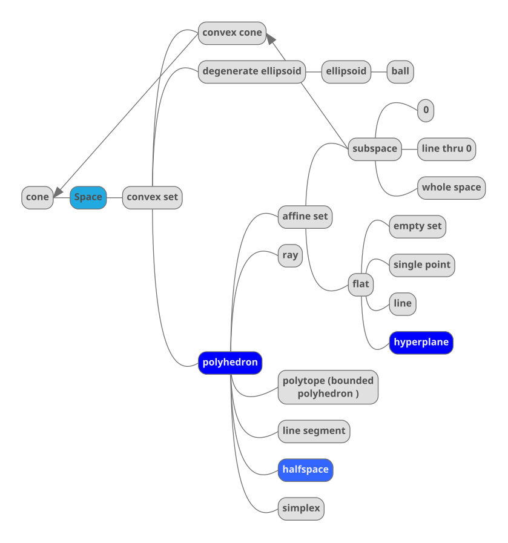

# Taxonomy Chart

# Definitions 

### Euclidean norm 

### affinely independent:
Suppose the $k + 1$ points $v_0, v_1, . . . , v_k \in \mathbb{R}^n$ are affinely independent, which means $v_1 − v_0, . . . , v_k − v_0$ are linearly independent.

### nonnegative orthant:
The set of points with nonnegative components.

### flat:
a flat is a subset of n-dimensional space that is congruent to a Euclidean space of lower dimension. The flats in two-dimensional space are points and lines, and the flats in three-dimensional space are points, lines, and planes. In n-dimensional space, there are flats of every dimension from 0 to n-1

Flats are similar to linear subspaces, except that they need not pass through the origin

### hyperplane:
In a space of dimension n, flats of dimension n−1 are called hyperplanes.

### cone:
second-order cone = quadratic cone = Lorentz cone = ice-cream cone

### polyhedron:
A polyhedron is the intersection of a finite number of halfspaces and hyperplanes.

### polytope:
A polytope is a bounded polyhedron 

### slab:
$\left\{x\in\mathbb{R}^n\middle|\alpha\le a^Tx\le\beta\right\}$ is the intersection of 2 halfspaces, hence it is a convex set and a polyhedron

### wedge:
$\left\{x\in\mathbb{R}^n\middle| a_1^Tx\le\beta_1,\ a_2^Tx\le\beta_2\right\}$ is the intersection of 2 halfspaces, hence it is a convex set and a polyhedron

### ball
### ellipsoid
Special case: An (Euclidean) ball is an ellipsoid with $P=r^2I$

### degenerate ellipsoid
where its affine dimension is equal to the rank of A.

# Statements

* Affine and Conves
    * The empty set $\phi$, any single point (i.e., singleton) $\{x_0\}$, and the whole space $\mathbb{R}^n$ are affine (hence, convex)
    * Any Line is affine (hence, convex)
    * If it passes through zero, it is a subspace, hence also a convex cone.
    * A line segment is convex, but not affine (unless it reduces to a point).
    * A ray is convex, but not affine. 
    * If a ray’s base ${x_0}$ is 0, then it’s a convex cone
    * Halfspaces are convex, but not affine
    * Any subspace is affine, and a convex cone (hence convex)

# Theorem

### Hyperplane separation theorem

Suppose $C$ and $D$ are nonempty disjoint convex sets, i.e. ${C \cap D=\emptyset}$, Then there exist $a \neq 0$ and $b$ such that $a^Tx\le b$ for all $x\in C$ and $a^Tx\geq b$ for all $x\in D$.

### Supporting hyperplane theorem

(To be continued)

